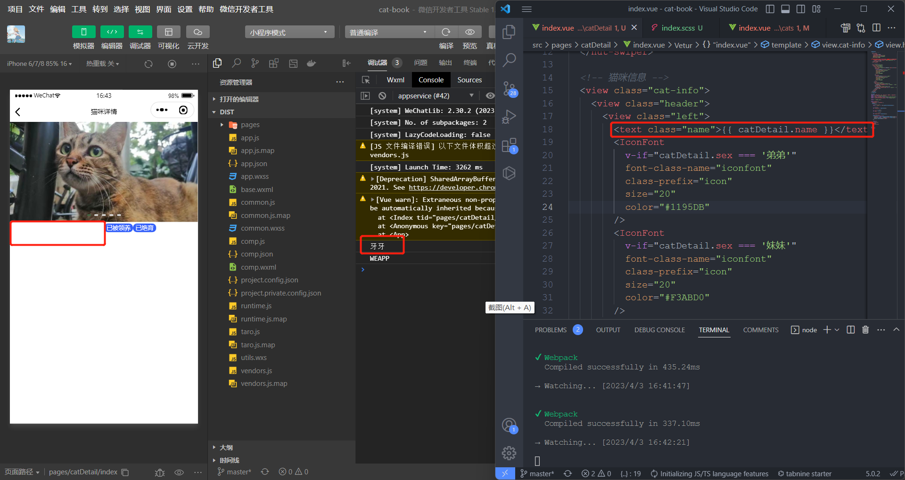

# 项目中遇到的问题

## 使用 nut-tabbar 组件报错

错误信息如下：

```
node:internal/process/promises:279
  triggerUncaughtException(err, true /* fromPromise */);
  ^
{
  moduleIdentifier: 'E:\\study\\senior_2\\cat-book\\cat-book\\node_modules\\.taro\\weapp\\prebundle\\style_iconfont-28afa0c8.css',
  moduleName: './node_modules/.taro/weapp/prebundle/style_iconfont-28afa0c8.css',
  loc: '1:0',
  message: "Module parse failed: Unexpected character '@' (1:0)\n" +
    'You may need an appropriate loader to handle this file type, currently no loaders are configured to process this file. See https://webpack.js.org/concepts#loaders\n'...
```

解决步骤：

1. [降低 node 版本](https://blog.csdn.net/m0_59910554/article/details/126308956)(未解决)

2. 删除 node_modules，重新安装依赖；将 taro 升级到 3.6.2(taro update project)，重启项目，错误解决，但是微信开发者工具报错，错误信息如下：

```
app.js错误:
 Error: module 'prebundle/vendors-node_modules_taro_weapp_prebundle_nutui_icons-vue-taro_js.wxss.js' is not defined, require args is './prebundle/vendors-node_modules_taro_weapp_prebundle_nutui_icons-vue-taro_js.wxss'
    at I (WASubContext.js?t=wechat&s=1678431611865&v=2.30.2:1)
    at r (WASubContext.js?t=wechat&s=1678431611865&v=2.30.2:1)
    at app.js:10
    at I (WASubContext.js?t=wechat&s=1678431611865&v=2.30.2:1)
    at <anonymous>:7:9
    at doWhenAllScriptLoaded (<anonymous>:7513:21)
    at <anonymous>:15:5
    at h.loadBabelModules (assubloader.js:1)(env: Windows,mp,1.06.2301040; lib: 2.30.2)
```

3. 发现是引入@nutui/icons-vue-taro 这个图标库的问题
   在 config/index.js 添加如下代码：

```js
compiler: {
  type: "webpack5",
  prebundle: { enable: false },
}
```

问题解决，原因：nutui 的样式可能不支持 taro3.5 以上版本的 prebundle

## nut-tabbar-item 组件的 href 属性失效

- 原因：添加 :href 之后 还要写 tab-switch 事件

- 具体代码如下：

```html
<nut-tabbar bottom safe-area-inset-bottom placeholder @tab-switch="tabSwitch">
  <nut-tabbar-item
    v-for="(item, index) in List"
    :key="item.title"
    :tab-title="item.title"
    :icon="item.icon"
    :href="item.link"
  >
  </nut-tabbar-item>
</nut-tabbar>
```

```js
function tabSwitch(item, index) {
  Taro.navigateTo({
    url: item.href,
  });
}
```

## 页面跳转后 tabbar-item 的选中状态不变

- 原因：在每个页面都使用了封装的 tabbar 组件，每次跳转页面，tabbar 组件都会重新加载，导致每次显示选中的都是第一个 tabbar-item

- 解决方案：给 tabbar 添加 v-model="active" 属性，并添加如下代码

```js
let active = ref(0);

const { router } = Taro.getCurrentInstance();
tabList.forEach((item, index) => {
  if (item.link === router.path) active.value = index;
});
```

## cats 页面接口获取猫咪数据后直接将整个数组重新赋值不生效

- 问题代码：

```js
onMounted(async () => {
  let { list } = await getCatList();
  catList = list;
});
```

- 修改如下：

```js
onMounted(async () => {
  let { list } = await getCatList();
  catList.push(...list);
});
```

- 具体参考<https://huaweicloud.csdn.net/639febc5dacf622b8df90329.html>

## 猫咪的卡片信息性格特点这一行由于文字较多，挤压了图标的空间，导致四个图标无法对齐

1. 设置图标或者文字的外边距，无法解决

2. 给文字设置一个宽度，问题解决

## 获取页面路由参数并根据参数发起请求

```js
// 获取当前路由
const { router } = Taro.getCurrentInstance();

// 猫咪详情
let catDetail = reactive({});

// 轮播图照片列表
let swiperList = reactive([]);

onMounted(async () => {
  catDetail = await getCatInfoAndPicsById(router.params.catId);
  swiperList.push(...catDetail.pics.filter((pic) => pic.isSwiper === 1));
});
```

## 猫咪详情页获取到了名字和性别但显示不了




- 错误原因：因为 Vue 的响应式系统是通过属性访问进行追踪的，因此我们必须始终保持对该响应式对象的相同引用。这意味着我们不可以随意地“替换”一个响应式对象，因为这将导致对初始引用的响应性连接丢失

- 解决方案：将 catDetail 用 ref 声明，或者将 catDetail 变成某个对象的属性，[参考链接](https://cn.vuejs.org/guide/essentials/reactivity-fundamentals.html#reactive-variables-with-ref)

## 修改 nut-ui 的 css 变量